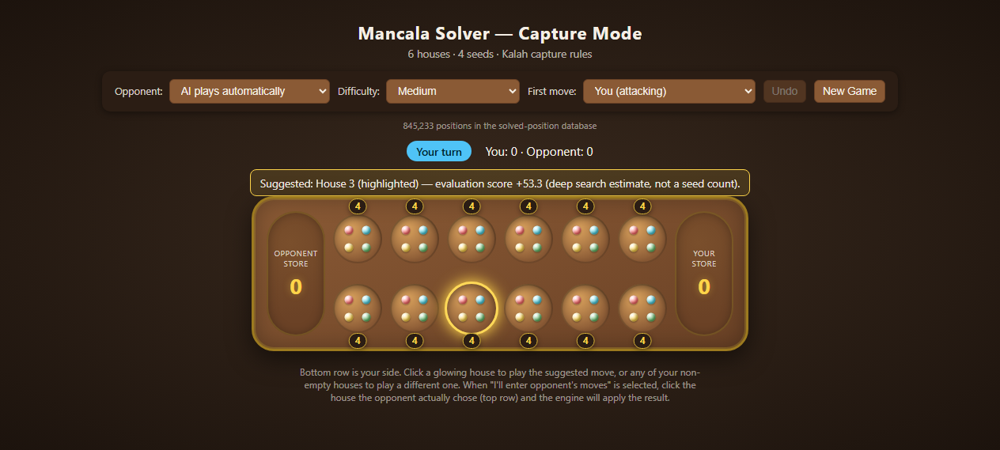

# Mancala Solver — Capture Mode (6×4)

A playable Kalah variant (6 houses · 4 seeds · capture rules) with a real search-based opponent, in a single `index.html` — no dependencies, no build step, no server. Open it in a browser and play.



## What it does

- **Plays a full legal game** against the engine (or walk through both sides manually): extra-turn rules and capture chains implemented to spec (`isHousePlayable`, `computeSowPath`).
- **Plans ahead**: iterative deepening over the game tree with heuristic leaf evaluation, plus a quiescence search (`qsearch`) so tactical capture chains are resolved before a position is scored.
- **Explains itself**: live move suggestion with search status, a highlighted recommended house, and hover previews showing where the last seed lands via a floating arrow and animated sowing token.
- **Difficulty ladder**: Easy (random) → Medium → Hard → Expert (deep search).
- **Opponent modes**: let the AI play automatically, or enter the opponent's moves yourself and let the engine apply the results — useful for analysis.
- **Remembers your game**: game state saved in IndexedDB (`openDb`/`loadAll`), so a reload resumes where you left off; Undo is available mid-game.

## Why this ruleset is interesting

Mancala is a compact but awkward testbed for adversarial search. Extra turns break the strict turn alternation that naive minimax assumes, and capture chains create long tactical sequences that shallow search mis-evaluates — which is exactly why this engine uses iterative deepening with a quiescence check at the leaves instead of fixed-depth search. All of it in one browser file with zero dependencies.

## Run

Open `index.html` in any modern browser. No server, install, or network access required.

## Layout

```
index.html   everything: engine, UI, styles (~1.1k lines)
assets/      README screenshot
```
